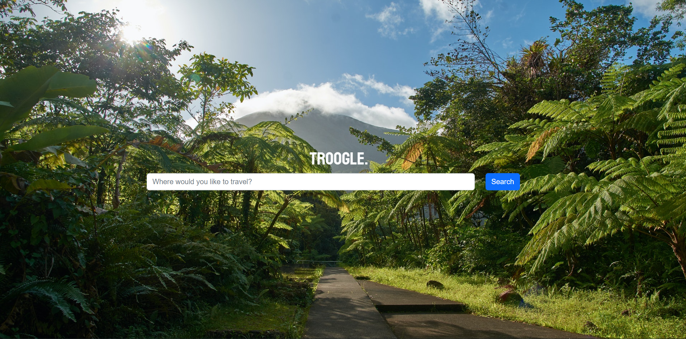
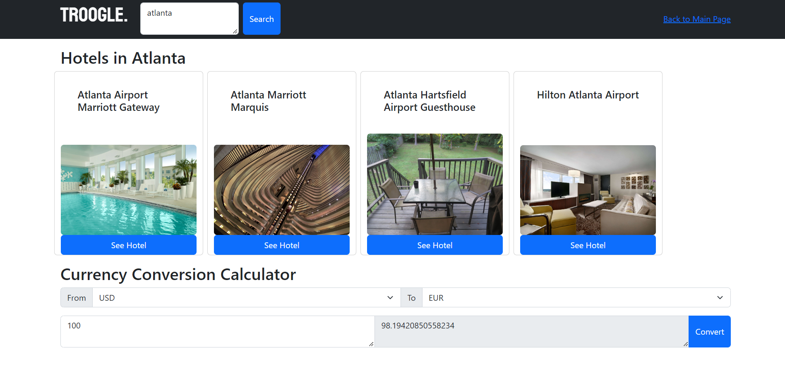

# Troogle: A Travel Website

## What is Troogle?
Troogle is an interactive website that lets you quickly search most travel destinations for nearby hotels. Troogle offers a handy calculator that can convert US Dollars into any currency so you know just how much bang you an get for your buck wherever you go. Just search for any city in the searchbar and Troogle will display some great hotel options for you to checkout.

## Technologies Used
Troogle uses a free API from rapidapi.com called [Hotels API](https://rapidapi.com/apidojo/api/hotels4/). This API allows the user to quickly find and view great hotel options for their desired location.

Troogle also uses a free API from [CurrencyFreaks](https://currencyfreaks.com/documentation.html#Authorization). This currency exchange rate API offers the user the ability to convert USD into any global currency.

## Screenshots

## Deployed Application
[Troogle](https://gabefando.github.io/travel-website/)